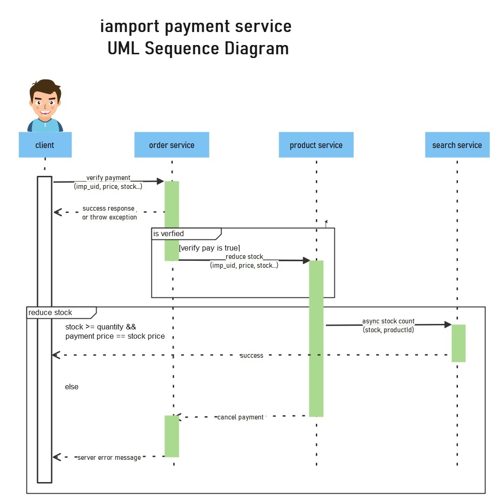

# jinheung-project

### jinheung-api-gateway

```
     spring server port : 8081
     
     기능 : 글로벌 인증 필터 
     헤더에 파싱된 유저아이디, 유저롤을 넣어줍니다
```

### jinheung-euraka-server

```
    기능 : 유레카 서버 해당 서비스 목록을 확인할 수 있다
```

### jinheung-user-profile (resource server)

```
    spring server port : 8082
    
    기능 : 유저의 정보, jwt 토큰 발행 및 파싱
```

### client-proxy 

```
    spring server port : 8083
    
    기능: kafka에서 보낸 여러 이벤트 들을 받아서 websocket으로 
    유저에게 전달 (ex 재고가 부족해요!, 잔액이 부족해요!)
    
```


### jinheung-shop

```
    shop main 8084
    기능 : 아임포트 결제 pay verify

    shop product 8085
    기능 : 재고를 차감하는 서비스
    재고가 없으면 메세지를 날린다
    재고의 수를 shop search와 동기화 시킨다 
    
    shop search 8086
    기능 : es를 이용한 제품 검색 


```
설계도


결제 시스템
